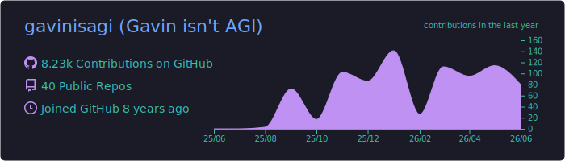
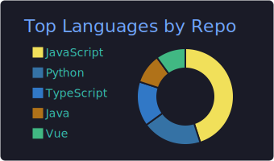

<!-- Capsule Render 顶部动态条幅：采用深色科技感渐变 -->

### ⚡ Product-Driven Full-Stack & Systems Developer
*Building robust open-source tools & high-performance enterprise solutions.*

<!-- Readme Typing SVG 动态打字机效果 -->

---

## 🚀 What I Do / 个人定位
我是一名兼顾工具开发与商业交付的 Full-Stack / 后端系统工程师。我倾向于用严谨的工程思维去解决复杂的业务痛点：

- 🛠️ **Open Source**：利用业余时间维护一些轻量、实用的开源效率小工具（CLI工具、自动化脚本、数据处理插件）。
- 💼 **Enterprise & B2B**：我的核心精力聚焦于闭源的企业级解决方案，提供高标准的 ToB 商业交付。主攻**高性能数据清洗引擎、自动化商业增长（BD）系统、以及企业级后端中间件**。
- ⚙️ **工程理念**：倡导高并发异步调度、追求干净的数据链路与极致的系统吞吐。

---

## 📦 Featured Works / 精选作品

### 🌐 Open Source Toolkits (开源工具)
> TBD

### 🔒 Enterprise Solutions (闭源商业/ToB 服务)
> *由于商业保密协议（NDA），核心商业项目均以私有库安全运行，具备高标准的工程质量：*
- **Financial Fact-Cleaning Engine** - 针对音视频数据的流式清洗与视觉校验引擎，服务于特定金融与内容风控场景。
- **Automated Business Development System** - 基于精准数据挖掘与智能分析的 ToB 客户增长/用户画像分析系统。
- **Custom High-Concurrency Middleware** - 高并发、低延迟的分布式数据索引与自动化审计中间件。

---

## 🛠️ Tech Stack

---

## 📈 Engineering Vitality

  <!-- 核心数据汇总卡片 -->
  

  <!-- 语言占比卡片 -->
  

